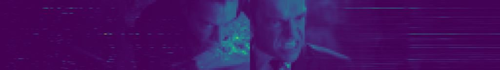
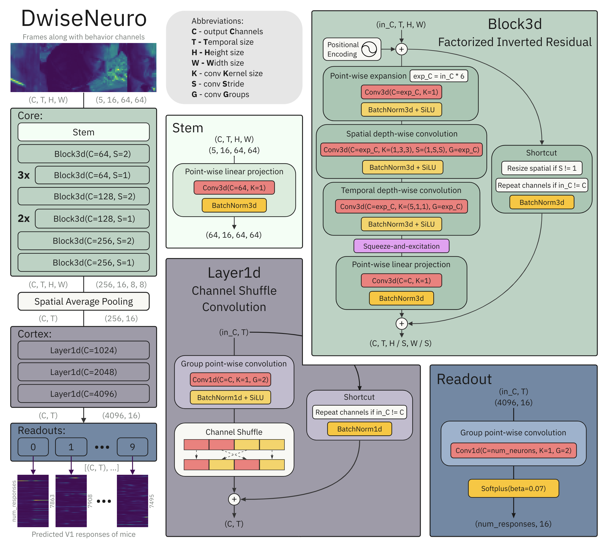
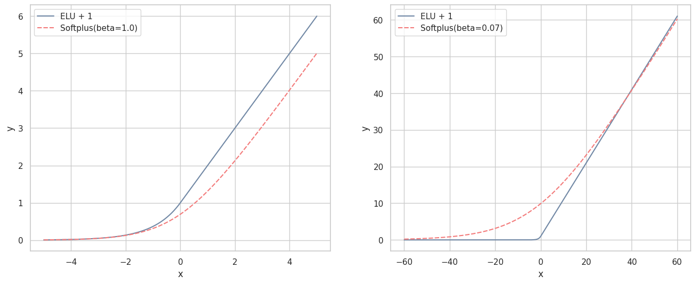

# Solution for Sensorium 2023 Competition



This repository contains the code to reproduce the winning solution to the Sensorium 2023, part of the NeurIPS 2023 competition track.
The competition aims to find the best model that can predict the activity of neurons in the primary visual cortex of mice in response to videos.
The competition introduced a temporal component using dynamic stimuli (videos) instead of static stimuli (images) used in Sensorium 2022, making the task more challenging.

The primary metric of the competition was a single trial correlation.
You can read about the metric, the data, and the task in the [competition paper](https://arxiv.org/abs/2305.19654) [1].
It is important to note that additional data for five mice was introduced during the competition, which doubled the dataset's size ([old](https://gin.g-node.org/pollytur/Sensorium2023Data) and [new](https://gin.g-node.org/pollytur/sensorium_2023_dataset) data).

## Solution

Key points:
* [DwiseNeuro](src/models/dwiseneuro.py) - novel model architecture for prediction neural activity in the mouse primary visual cortex
* Solid cross-validation strategy with splitting folds by perceptual video hash
* Training on all mice with an option to fill unlabeled samples via distillation

## Model Architecture

During the competition, I dedicated most of my time to designing the model architecture since it significantly impacted the solution's outcome compared to other components.
I iteratively tested various computer vision and deep learning techniques, integrating them into the architecture as the correlation metric improved.

The diagram below illustrates the final architecture, which I named DwiseNeuro:



DwiseNeuro consists of three main parts: core, cortex, and readouts.
The core consumes sequences of video frames and mouse behavior activity in separate channels, processing temporal and spatial features.
Produced features pass through global pooling over spatial dimensions to aggregate them.
The cortex processes the pooled features independently for each timestep, significantly increasing the channels.
Finally, each readout predicts the activation of neurons for the corresponding mouse.

In the following sections, we will delve deeper into each part of the architecture.

### Core

The first layer of the module is the stem. It's a point-wise convolution for increasing the number of channels, followed by batch normalization.
The rest of the core consists of inverted residual blocks [2, 3] with a `narrow -> wide -> narrow` channel structure. 

#### Techniques

Several methods were added to the inverted residual block:
* **Absolute Position Encoding** [4] - summing the encoding to the input of each block allows convolutions to accumulate position information. It's quite important because of the subsequent spatial pooling after the core.
* **Factorized (2+1)D convolution** [5] - 3D depth-wise convolution was replaced with a spatial 2D depth-wise convolution followed by a temporal 1D depth-wise convolution. There are spatial convolutions with stride two in some blocks to compress output size.
* **Shortcut Connections** - completely parameter-free residual shortcuts with three operations: 
    * Identity mapping if input and output dimensions are equal. It's the same as the connection proposed in ResNet [6].
    * Nearest interpolation in case of different spatial sizes. 
    * Cycling repeating of channels if they don't match.
* **Squeeze-and-Excitation** [7] - dynamic channel-wise feature recalibration.
* **DropPath (Stochastic Depth)** [8, 9] - regularization that randomly drops the block's main path for each sample in batch.

Batch normalization is applied after each layer, including the shortcut. 
SiLU activation is used after expansion and depth-wise convolutions.

#### Hyperparameters

I found that the number of core blocks and their parameters dramatically affect the outcome.
It's possible to tune channels, strides, expansion ratio, and spatial/temporal kernel sizes.
Obviously, it is almost impossible to start experiments with optimal values.
The problem is mentioned in the EfficientNet [3] paper, which concluded that it is essential to carefully balance model width, depth, and resolution.

After conducting a lot of experiments, I chose the following parameters:
* Four blocks with 64 output channels, three with 128, and two with 256.
* Three blocks have stride two. They are the first in each subgroup from the point above.
* Expansion ratio of the inverted residual block is six.
* Kernel of spatial depth-wise convolution is (1, 3, 3).
* Kernel of temporal depth-wise convolution is (5, 1, 1).

### Cortex

Compared with related works [10], the model architecture includes a new part called the cortex.
It is also common for all mice as the core.
The cortex receives features with only channels and temporal dimensions.
Spatial information was accumulated thanks to position encoding applied previously in the core and compressed by average pooling after the core.
The primary purpose of the cortex is to smoothly increase the number of channels, which the readouts will further use.

The building element of the module is a grouped 1D convolution followed by the channel shuffle operation [11].
Similar to the core, shortcut connections with stochastic depth are also applied.
Batch normalization and SiLU were applied the same way as in the core.

#### Hyperparameters

Hyperparameters of the cortex were also important:
* Convolution with two groups and kernel size one. Bigger kernel size over temporal dimension has not led to better results.
* Three layers with 1024, 2048, and 4096 channels.

As you can see, the number of channels is quite large.
Groups help optimize computation and memory efficiency.
Channel shuffle operation allows the sharing of information between groups of different layers.

### Readouts

The readout is a single 1D convolution with two groups and kernel size one, followed by Softplus activation.
Each of the ten mice has its readout with the number of output channels equal to the number of neurons (7863, 7908, 8202, 7939, 8122, 7440, 7928, 8285, 7671, 7495, respectively).

#### Softplus

Keeping the response positive by using Softplus was essential in my pipeline.
It works much better than `ELU + 1` [10], especially with tuning the Softplus beta parameter.
In my case, the optimal beta value was about 0.07, which resulted in a 0.018 increase in the correlation metric.

You can see a comparison of `ELU + 1` and Softplus in the plot below:



#### Learnable Softplus

I also conducted an experiment where the beta parameter was trainable.
Interestingly, the trained value converged approximately to the optimal, which I found by grid search.
I omitted the learnable Softplus from the solution because it resulted in a slightly worse score.
But this may be an excellent way to quickly and automatically find a good beta.

Here's a numerical stable implementation of learnable Softplus in PyTorch:

```Python
import torch
from torch import nn


class LearnableSoftplus(nn.Module):
    def __init__(self, beta: float):
        super().__init__()
        self.beta = nn.Parameter(torch.tensor(float(beta)))

    def forward(self, x):
        xb = x * self.beta
        return (torch.clamp(xb, 0) + torch.minimum(xb, -xb).exp().log1p()) / self.beta
```

## Training

### Validation strategy

At the end of the competition, I employed 7-fold cross-validation to check hypotheses and tune hyperparameters more precisely.
I used all available labeled data to make folds.
Random splits gave an overly optimistic metric estimation because some videos were duplicated (e.g., in the original validation split or between old and new datasets).
To solve this issue, I created group folds with non-overlapping videos.
Similar videos were found using [perceptual hashes](src/phash.py) of several frames fetched deterministically.

### Basic training ([config](configs/true_batch_001.py))

The training was performed in two stages. The first stage is basic training with the following pipeline parameters:
* Learning rate warmup for the first three epochs from 0 to 2.4e-03, cosine annealing last 18 epochs to 2.4e-05
* Batch size 32, one training epoch comprises 72000 samples
* Optimizer AdamW with weight decay 0.05
* Poisson loss
* Model EMA with decay 0.999
* CutMix [12] with alpha 1.0 and usage probability 0.5
* The sampling of different mice in the batch is random by uniform distribution

Each dataset sample consists of a grayscale video, behavior activity measurements (pupil center, pupil dilation, and running speed), and the neuron responses of a single mouse.
All data is presented at 30 FPS. During training, the model consumes 16, skipping every second frame (equivalent to 16 neighboring frames at 15 FPS).
The video frames were zero-padded to 64x64 pixels. The behavior activities were added as separate channels. No normalization is applied to the target and input tensors during training.

The ensemble of models from all folds gets 0.2905 single-trial correlation on the main track and 0.2207 on the bonus track in the final phase of the competition.
This result would be enough to take first place in both tracks.

### Knowledge Distillation ([config](configs/distillation_001.py))

For an individual sample in the batch, the loss was calculated for the responses of only one mouse.
Because the input tensor is associated with a single mouse trial, and there are no neural activity data for other mice.
However, the model can predict responses for all mice from the input tensor. In the second stage of training, I used a method similar to knowledge distillation [13].
I created a pipeline where models from the first stage predict unlabeled responses during training.
As a result, the second-stage models trained all their readouts via each batch sample.
The loss value on distilled predictions was weighed to be 0.36% of the overall loss.

The hyperparameters were identical, except for the expansion ratio in inverted residual blocks: seven in the first stage and six in the second.

In the second stage, the ensemble of models achieves nearly the same single-trial correlation as the ensemble from the first stage.
However, what is fascinating is that each fold model performs better by an average score of 0.007 than the corresponding model from the first stage.
Thus, the distilled model works like an ensemble of undistilled models.
According to the work [14], the individual model is forced to learn the ensemble's performance during knowledge distillation, and an ensemble of distilled models offers no more performance boost.
I can observe the same behavior in my solution.

Distillation can be a great practice if you need one good model.
But in ensembles, this leads to minor changes in performance.

## Prediction

The ensembles were produced by taking the arithmetic mean of predictions from multiple steps:
* Overlapping a sliding window over each possible sequence of frames 
* Models from cross-validations of one training stage
* Training stages (optional)

I used the same model weights for the main and bonus (out-of-distribution) competition tracks.

## Competition progress

You can see the progress of solution development during the competition in [spreadsheets](https://docs.google.com/spreadsheets/d/1xJTB6lZvtjNSQbYQiB_hgKIrL9hUB0uL3xhUAK1Pmxw/edit#gid=0) (the document consists of multiple sheets).
Unfortunately, the document contains less than half of the conducted experiments because sometimes I was too lazy to fill it :)
However, if you need a complete chronology of valuable changes, you can see it in git history.

To summarize, an early model with depth-wise 3D convolution blocks achieved a score of around 0.19 on the main track during the live phase of the competition. 
Subsequently, implementing techniques from the core section, tuning hyperparameters, and training on all available data boosted the score to 0.25.
Applying non-standard normalization, expected by evaluation servers, on postprocessing improved the score to 0.27.
The cortex and CutMix increased the score to 0.276. 
Then, the beta value of Softplus was tuned, resulting in a score of 0.294.
Lastly, adjusting drop rate and batch size parameters helped to achieve a score of 0.3 on the main track during the live phase.

The ensemble of the basic and distillation training stages achieved a single-trial correlation of 0.2913 on the main track and 0.2215 on the bonus track in the final phase (0.3005 and 0.2173 in the live phase, respectively).
This result was enough for first place in both tracks of the competition.

## References

[1] Dynamic Sensorium competition https://arxiv.org/abs/2305.19654  
[2] MobileNetV2 https://arxiv.org/abs/1801.04381  
[3] EfficientNet https://arxiv.org/abs/1905.11946  
[4] Attention Is All You Need https://arxiv.org/abs/1706.03762  
[5] R(2+1)D https://arxiv.org/abs/1711.11248v3  
[6] ResNet https://arxiv.org/abs/1512.03385  
[7] Squeeze-and-Excitation https://arxiv.org/abs/1709.01507  
[8] DropPath https://arxiv.org/abs/1605.07648v4  
[9] Stochastic Depth https://arxiv.org/abs/1603.09382  
[10] Generalization in data-driven models of primary visual cortex https://openreview.net/forum?id=Tp7kI90Htd  
[11] ShuffleNet https://arxiv.org/abs/1707.01083v2  
[12] CutMix https://arxiv.org/abs/1905.04899  
[13] Knowledge Distillation https://arxiv.org/abs/1503.02531  
[14] Towards Understanding Ensemble, Knowledge Distillation and Self-Distillation in Deep Learning https://arxiv.org/abs/2012.09816  

## Quick setup and start

### Requirements

* Linux (tested on Ubuntu 20.04 and 22.04)
* NVIDIA GPU (models trained on RTX A6000)
* NVIDIA Drivers >= 520, CUDA >= 11.8
* [Docker](https://docs.docker.com/engine/install/)
* [NVIDIA Container Toolkit](https://docs.nvidia.com/datacenter/cloud-native/container-toolkit/install-guide.html)

Pipeline tuned for training on a single RTX A6000 with 48 GB.
In the case of GPU with less memory, you can use gradient accumulation by increasing the `iter_size` parameter in training configs.
It will worsen the result (by a 0.002 score for `"iter_size": 2`), but it has less than the effect of reducing the batch size.

### Run

Clone the repo and enter the folder.

```bash
git clone git@github.com:lRomul/sensorium.git
cd sensorium
```

Build a Docker image and run a container.

<details><summary>Here is a small guide on how to use the provided Makefile</summary>

```bash
make  # stop, build, run

# do the same
make stop
make build
make run

make  # by default all GPUs passed
make GPUS=all  # do the same
make GPUS=none  # without GPUs

make run GPUS=2  # pass the first two GPUs
make run GPUS='\"device=1,2\"'  # pass GPUs numbered 1 and 2

make logs
make exec  # run a new command in a running container
make exec COMMAND="bash"  # do the same
make stop
```

</details>

```bash
make
```

From now on, you should run all commands inside the docker container.

If you already have the Sensorium 2023 dataset (148 GB), copy it to the folder `./data/sensorium_all_2023/`.
Otherwise, use the script for downloading:

```bash
python scripts/download_data.py
```

You can now reproduce the final results of the solution using the following commands:
```bash
# Train
# The training time is 3.5 days (12 hours per fold) for each experiment on a single A6000
# You can speed up the process by using the --folds argument to train folds in parallel
# Or just download trained weights in the section below
python scripts/train.py -e true_batch_001
python scripts/train.py -e distillation_001

# Predict
# Any GPU with more than 6 GB memory will be enough
python scripts/predict.py -e true_batch_001 -s live_test_main
python scripts/predict.py -e true_batch_001 -s live_test_bonus
python scripts/predict.py -e true_batch_001 -s final_test_main
python scripts/predict.py -e true_batch_001 -s final_test_bonus
python scripts/predict.py -e distillation_001 -s live_test_main
python scripts/predict.py -e distillation_001 -s live_test_bonus
python scripts/predict.py -e distillation_001 -s final_test_main
python scripts/predict.py -e distillation_001 -s final_test_bonus

# Ensemble predictions of two experiments
python scripts/ensemble.py -e distillation_001,true_batch_001 -s live_test_main
python scripts/ensemble.py -e distillation_001,true_batch_001 -s live_test_bonus
python scripts/ensemble.py -e distillation_001,true_batch_001 -s final_test_main
python scripts/ensemble.py -e distillation_001,true_batch_001 -s final_test_bonus

# Final predictions will be there
cd data/predictions/distillation_001,true_batch_001
```

### Trained model weights

You can skip the training step by downloading model weights (9.5 GB) using [torrent file](data/experiments.torrent).  

Place the files in the data directory so that the folder structure is as follows:

```
data
├── experiments
│   ├── distillation_001
│   └── true_batch_001
└── sensorium_all_2023
    ├── dynamic29156-11-10-Video-8744edeac3b4d1ce16b680916b5267ce
    ├── dynamic29228-2-10-Video-8744edeac3b4d1ce16b680916b5267ce
    ├── dynamic29234-6-9-Video-8744edeac3b4d1ce16b680916b5267ce
    ├── dynamic29513-3-5-Video-8744edeac3b4d1ce16b680916b5267ce
    ├── dynamic29514-2-9-Video-8744edeac3b4d1ce16b680916b5267ce
    ├── dynamic29515-10-12-Video-9b4f6a1a067fe51e15306b9628efea20
    ├── dynamic29623-4-9-Video-9b4f6a1a067fe51e15306b9628efea20
    ├── dynamic29647-19-8-Video-9b4f6a1a067fe51e15306b9628efea20
    ├── dynamic29712-5-9-Video-9b4f6a1a067fe51e15306b9628efea20
    └── dynamic29755-2-8-Video-9b4f6a1a067fe51e15306b9628efea20
```
